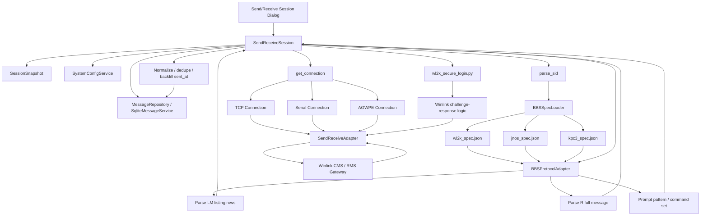

# WL2K (Winlink CMS) Implementation Notes

## Overview

This document describes the implementation of **Winlink CMS (WL2K)** support in OutpostX.

The WL2K integration enables:

- TELNET access to Winlink CMS servers
- Secure login using challenge/response (`;PQ:` / `;PR:`)
- Message listing (`LM`)
- Message retrieval (`R <msgid>`)
- Message deletion (`K <msgid>`)
- Proper parsing and storage into the OutpostX database

This implementation follows the standard OutpostX architecture:

- Transport handled via adapter layer (TELNET / AGWPE / Serial)
- Session orchestration in `send_receive_session.py`
- BBS-specific behavior defined via `wl2k_spec.json`

---

## WL2K Login Flow

```mermaid
sequenceDiagram
    participant Client as OutpostX
    participant Server as Winlink CMS

    Client->>Server: TCP Connect (TELNET)
    Server-->>Client: Callsign:
    Client->>Server: KN6PE

    Server-->>Client: Password:
    Client->>Server: CMSTELNET (account_password)

    Server-->>Client: [WL2K-...]
    Server-->>Client: ;PQ: 73149074
    Server-->>Client: CMS>

    Client->>Server: [OUTPOSTX-26.04.0]
    Client->>Server: ;PR: ########

    Note over Server: Authentication complete

    Client->>Server: LM
    Server-->>Client: Message listing + CMS>
```

---

## WL2K Send/Receive Lifecycle

```mermaid
sequenceDiagram
    participant Client as OutpostX
    participant Server as Winlink CMS
    participant DB as OutpostX DB

    Note over Client,Server: Session already logged in and authenticated

    Client->>Server: LM
    Server-->>Client: ;PM: ... (ignored)
    Server-->>Client: <msgid> <date> <time> <size> <from> <subject>
    Server-->>Client: CMS>

    Note over Client: Parse LM rows
    Note over Client: Build eligible message list

    loop For each eligible message
        Client->>Server: R <msgid>
        Server-->>Client: Subject:
        Server-->>Client: Message ID:
        Server-->>Client: Date:
        Server-->>Client: From:
        Server-->>Client: To:
        Server-->>Client: Source:
        Server-->>Client: CMS Site:
        Server-->>Client: blank line
        Server-->>Client: Message body
        Server-->>Client: CMS>

        Note over Client: Strip trailing prompt
        Note over Client: Normalize line endings
        Note over Client: Parse headers + body

        Client->>DB: upsert inbound message

        alt delete_on_bbs enabled
            Client->>Server: K <msgid>
            Server-->>Client: Removal completed
            Server-->>Client: CMS>
        end
    end

    Client->>Server: B
    Server-->>Client: Disconnecting...
```

---

## WL2K Architecture in OutpostX



---

## Two-Stage Authentication

Winlink requires **two distinct passwords**:

### 1. Server Access Password

- Used at `Password :` prompt
- Example: `CMSTELNET`
- Stored as:

```text
bbs.account_password
```

### 2. Mailbox Password

- Used in challenge/response
- Stored as:

```text
bbs.access_password
```

---

## Secure Login Algorithm

### Challenge

```text
;PQ: 73149074
```

### Response

```text
;PR: ########
```

### Algorithm

```text
MD5( ASCII(challenge + password) + salt )
```

Then:

```text
value = ((digest[3] & 0x3F) << 24) |
        ( digest[2]        << 16) |
        ( digest[1]        <<  8) |
          digest[0]
```

Final response:

```text
last 8 digits of value formatted as 10 digits
```

---

## SID Handling

OutpostX sends:

```text
[OUTPOSTX-26.04.0]
```

### Version Strategy

- Internal release version: `26.04.0-beta`
- Protocol SID version: `26.04.0`
- UI / docs label: `OutpostX 26.04.0 Beta`

---

## Message Listing (LM)

### Command

```text
LM
```

### Example

```text
;PM: KN6PE H12BL0FFTBRY ...
H12BL0FFTBRY 2026/04/16 03:21 454 K6KP@winlink.org Subject...

CMS>
```

### Notes

- `;PM:` lines are ignored for manual OutpostX operations
- Valid message rows contain:
  - message ID
  - date
  - time
  - size
  - from
  - subject

---

## Message Retrieval

### Command

```text
R <msgid>
```

### Example Response

```text
Subject: Test message
Message ID: H12BL0FFTBRY
Date: 2026/04/16 03:21
From: K6KP
To: KN6PE
Source: K6KP
CMS Site: CMS-A

Message body...
```

---

## Key Implementation Details

### 1. Line Ending Normalization (Critical)

WL2K frequently returns text using CR-only line endings:

```text
\r
```

This caused:

- LM parsing failures
- message truncation
- prompt stripping errors
- incomplete header/body parsing

### Fix

Normalize all input before parsing:

```python
text.replace("\r\n", "\n").replace("\r", "\n")
```

Applied in:

- `_strip_trailing_prompt()`
- listing parsing path
- full-message parsing path

---

### 2. Prompt Handling

WL2K prompt:

```text
CMS>
```

Important behavior:

- `CMS>` appears immediately after `;PQ:`
- no new prompt appears after `;PR:`
- OutpostX must detect `CMS>` **before** sending the SID and PR response
- after `;PR:`, the next session command can proceed directly

---

### 3. Prompt Stripping Fix

Original issue:

- `_strip_trailing_prompt()` assumed LF-delimited lines
- WL2K sometimes returned `\r\rCMS>\r`
- the final body line could be removed along with the prompt

### Fix

Normalize line endings inside `_strip_trailing_prompt()` before locating the final prompt line.

---

### 4. LM Parsing Fix

Problem:

- `rows=0` even though `LM` returned a valid message row

Cause:

- CR-only input prevented the row parser from seeing normal line breaks

Fix:

- normalize listing text before calling `parse_message_listing_rows()`

---

### 5. PRIVATE Filtering Adjustment

Standard PRIVATE/NTS logic filters by the LM row’s `To:` field.

WL2K LM rows do **not** include a `To:` field.

### Fix

Skip TO-field filtering for WL2K because the mailbox is already scoped to the logged-in user.

```python
if spec_id != "wl2k":
    apply TO filter
```

---

### 6. `sent_at` Backfill

Problem:

- `Date:` header did not always surface into `parsed["sent_at"]`

Fix:

- use the LM row as an authoritative fallback

```python
raw_sent_at = f"{row['date']} {row['time']}"
```

That value is then converted using the existing BBS datetime parser.

---

### 7. `bbsmsgno` Handling

- WL2K message IDs are stable and unique
- use the Winlink message ID directly as `bbsmsgno`
- fallback to `msg_id` if parsing does not surface `Message ID:`

---

## RF Considerations (RMS)

When using RMS over RF rather than TELNET, expect:

- lower throughput
- more fragmented delivery
- more variable latency
- delayed prompts

Potential impacts:

- prompt detection timing
- message completeness during reads
- larger need for quiet-settle delays in selected paths

Mitigations already in place:

- prompt-driven flow
- robust line-ending normalization
- safer prompt stripping
- optional `wait_quiet()` tuning where needed

---

## Files Involved

- `send_receive_session.py`
- `services/wl2k_secure_login.py`
- `data/bbs_specs/wl2k_spec.json`

---

## Testing Status

### Completed

- TELNET login ✔
- secure authentication ✔
- LM parsing ✔
- message retrieval ✔
- message deletion ✔
- DB storage (`bbsmsgno`, `sent_at`) ✔

### Pending

- RF (RMS) validation
- additional edge-case parsing
- cleanup of temporary debug instrumentation

---

## Lessons Learned

1. Normalize early and consistently.
2. WL2K prompt timing is different from many PBBS systems.
3. Spec-driven parsing works well and keeps the session engine clean.
4. LM rows are a reliable fallback source for WL2K metadata.
5. Fixing helper behavior centrally is often better than scattering call-site workarounds.

---

## Next Steps

- Validate operation over RF / RMS
- Remove temporary WL2K debug logging
- Refine edge-case parsing if discovered during field testing
- Begin BPQMailChat implementation

---

End of Document
